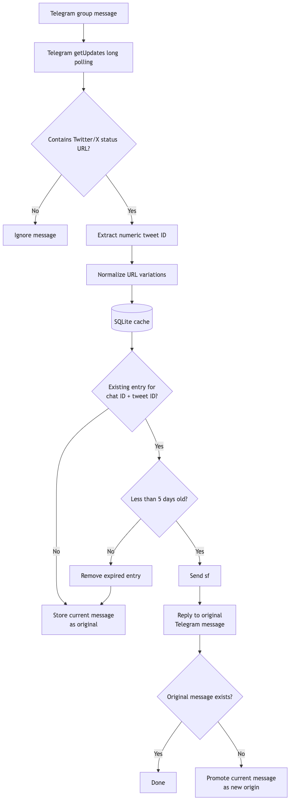

# sfbot

`sfbot` watches a Telegram group for Twitter/X status links. If the same post
was shared in that chat during the previous five days, it sends `sf` as a reply
to the first message so tapping the reply navigates to the original share.

The canonical key is Twitter's numeric status ID. As a result, `twitter.com`
and `x.com` links, different usernames, mobile subdomains, tracking parameters,
and `/photo/1` suffixes all resolve to the same post. Origins are stored in an
indexed SQLite database and scoped per Telegram chat.

## Architecture



## Prerequisites

The shared Telegram bot already exists, has Group Privacy disabled, and has
been added to the group. Obtain its token securely from the maintainer and put
it in an uncommitted `.env` file:

```dotenv
TELEGRAM_BOT_TOKEN=replace-with-the-real-token
```

Never commit or post the token. Only one instance may use it at a time because
Telegram permits only one active `getUpdates` poller per bot.

## Run locally

Python 3.11 or newer and Make are required. The bot has no third-party runtime
dependencies. From the repository root, run:

```sh
make run
```

If the Python.org macOS installation reports `CERTIFICATE_VERIFY_FAILED`, use
the installed `certifi` bundle:

```sh
SSL_CERT_FILE="$(python3.11 -m certifi)" make run
```

Stop the bot with `Ctrl+C`. The local cache is stored at `data/sfbot.db`.

Run the tests with:

```sh
make test
```

Run the complete local check, including bytecode compilation, with:

```sh
make check
```

The Makefile uses `python3.11` by default. Override it when using another
supported interpreter:

```sh
make check PYTHON=python3.12
```

## Run on the homelab

The production instance runs as one Docker container on the group's homelab.
It uses Telegram long polling, so the host needs outbound HTTPS access but no
domain, reverse proxy, port forwarding, or inbound port.

After cloning the repository, create `.env` as shown above and run:

```sh
chmod 600 .env
docker compose up -d --build
docker compose ps
make logs
```

Docker's `restart: unless-stopped` policy restarts the bot after a crash or host
reboot, provided the Docker service starts at boot. The `sfbot-data` named
volume preserves `/data/sfbot.db` across container rebuilds.

To deploy a new revision:

```sh
git pull
docker compose up -d --build
make logs
```

## One-bot development workflow

Never run the homelab and local instances simultaneously. Before a live local
test, stop production on the homelab:

```sh
docker compose stop sfbot
```

Run the bot locally with `make run`, stop it with `Ctrl+C`, then restore
production on the homelab:

```sh
docker compose start sfbot
```

Local testing uses a separate SQLite database, so production may not remember
links consumed while the local instance was active. This is acceptable for the
bot's short, non-critical five-day history.

## Configuration

| Variable | Default | Purpose |
| --- | --- | --- |
| `TELEGRAM_BOT_TOKEN` | Required | Token for the shared Telegram bot |
| `SFBOT_DB_PATH` | `data/sfbot.db` | SQLite database path |
| `SFBOT_RETENTION_DAYS` | `5` | Duplicate window in whole days |
| `SFBOT_POLL_TIMEOUT` | `30` | Telegram long-poll timeout in seconds |
| `SFBOT_LOG_LEVEL` | `INFO` | Python log level |

## Behavior details

- Deduplication is per Telegram chat, not global across every group.
- The earliest share remains the reply target for the five-day window.
- If the original message was deleted, the current share becomes the new
  origin without sending an orphaned `sf` reply.
- Text messages, media captions, and links hidden behind Telegram linked text
  are supported.
- `t.co` links are not resolved.
