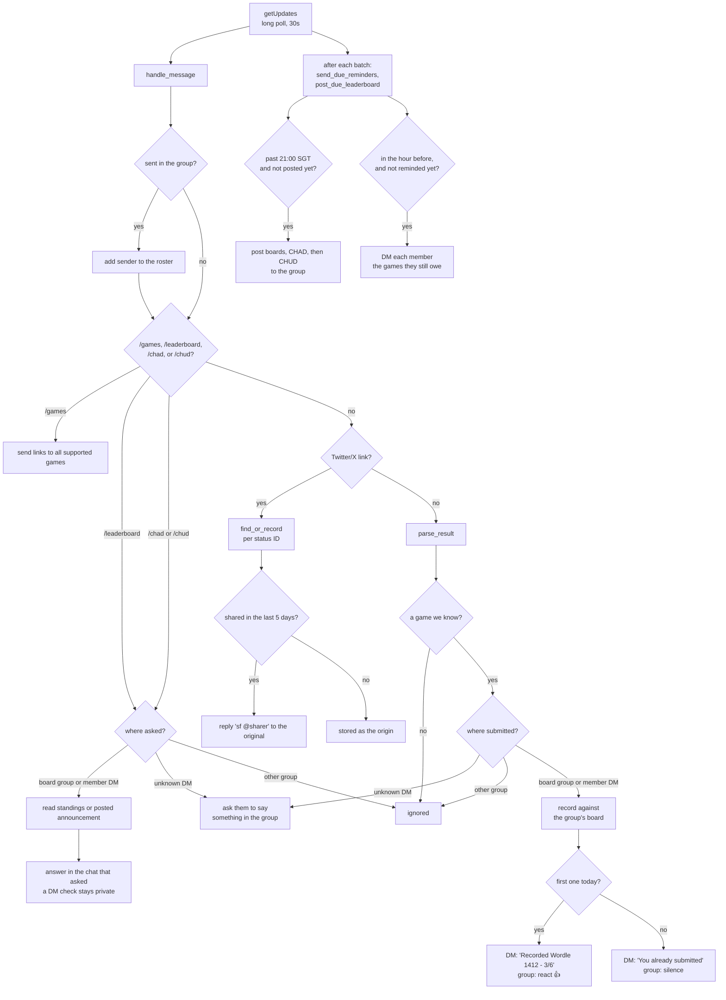

# sfbot

`sfbot` does two things for a Telegram group: it calls out repeated Twitter/X
posts, and it collects everyone's daily puzzle-game results by direct message so
the group gets a leaderboard and daily winner announcements instead of everyone's
share text.

## Repeated links

`sfbot` watches a Telegram group for Twitter/X status links. If the same post
was shared in that chat during the previous five days, it sends `sf @username`
as a reply to the first message. The mention names the person who shared the
duplicate; tapping the reply navigates to the original share. People without a
username get a clickable name mention instead.

Setting `SFBOT_ACTION_WORD` adds a callout naming whoever reposted. With
`SFBOT_ACTION_WORD=Nuke`, Alice sharing a post and Bob resharing it gets:

```
sf @Bob                                     (a reply to Alice's message)
Uh oh! Looks like Bob's getting *Nuked*
Let's drop a /NukeBob
```

The past tense is the word plus `d`, so the word is expected to end in `e`. The
asterisks are literal: the bot sends no `parse_mode`, so nothing in a display
name ever needs escaping.

The name is the person's Telegram first name unless `SFBOT_NICKNAMES` gives one
for them; see [Nicknames](#nicknames).

Links are matched by numeric status ID within each chat. Twitter/X domains,
usernames, mobile subdomains, tracking parameters, and `/photo/1` suffixes do
not affect matching. The first share remains the reply target for five days.
Text, media captions, and hidden links are supported; `t.co` links are not resolved.

## Nicknames

Some people go by something other than their Telegram name. `SFBOT_NICKNAMES`
holds comma-separated `user_id:nickname` pairs and overrides the Telegram name
everywhere the bot names someone — the `sf` reply's mention, the repeat-poster
callout, the leaderboard, and the CHAD and CHUD announcements — so Bob who goes
by Juan gets `/NukeJuan`:

```dotenv
SFBOT_NICKNAMES=123456789:Juan,987654321:Nikki
```

Find numeric user IDs in the debug logs:

```sh
SFBOT_LOG_LEVEL=DEBUG make run
# ... Message from user 123456789 (Bob)
```

Anyone without an entry keeps their Telegram name. The bot is restarted for a
change to take effect. The current nickname also appears for scores submitted
before the change, and for a CHAD or CHUD announcement repeated after it: the
winner is stored by user ID, so `/chad` and `/chud` name them the way the bot
would name them today. A day posted before that was recorded has only the
message it sent, so the names in it are swapped for nicknames where they still
belong to one player of that day.

## Architecture

One process, one SQLite file, no inbound network. Commands, repeated links, and
game results are handled as separate paths; the daily post is checked once per
polling cycle.


```mermaid
flowchart TD
    A["getUpdates<br/>long poll, 30s"] --> B["handle_message"]

    B --> Z{"sent in the group?"}
    Z -->|yes| Z2["add sender to the roster"]
    Z2 --> C
    Z -->|no| C

    C{"/games, /leaderboard,<br/>/chad, or /chud?"}
    C -->|/games| D4["send links to all supported games"]
    C -->|/leaderboard| D{"where asked?"}
    C -->|/chad or /chud| D
    D -->|board group or member DM| D3["read standings or posted announcement"]
    D -->|unknown DM| D2["ask them to say<br/>something in the group"]
    D -->|other group| M
    D3 --> E["answer in the chat that asked<br/>a DM check stays private"]

    C -->|no| F{"Twitter/X link?"}
    F -->|yes| G["find_or_record<br/>per status ID"]
    G --> H{"shared in the last 5 days?"}
    H -->|yes| I["reply 'sf @sharer' to the original"]
    H -->|no| J["stored as the origin"]

    F -->|no| K["parse_result"]
    K --> L{"a game we know?"}
    L -->|no| M["ignored"]
    L -->|yes| L2{"where submitted?"}
    L2 -->|unknown DM| D2
    L2 -->|other group| M
    L2 -->|board group or member DM| N["record against<br/>the group's board"]
    N --> O{"first one today?"}
    O -->|yes| P["DM: 'Recorded Wordle 1412 - 3/6'<br/>group: react 👍"]
    O -->|no| Q["DM: 'You already submitted'<br/>group: silence"]

    A --> R["after each batch:<br/>send_due_reminders,<br/>post_due_leaderboard"]
    R --> S{"past 21:00 SGT<br/>and not posted yet?"}
    S -->|yes| T["post boards, CHAD, then CHUD<br/>to the group"]
    R --> U{"in the hour before,<br/>and not reminded yet?"}
    U -->|yes| V["DM each member<br/>the games they still owe"]
```

Members can submit results by DM without posting their share text to the group.

## Prerequisites

The shared Telegram bot already exists, has Group Privacy disabled, and has
been added to the group. Obtain its token securely from the maintainer and put
it in an uncommitted `.env` file:

```dotenv
TELEGRAM_BOT_TOKEN=replace-with-the-real-token
SFBOT_LEADERBOARD_CHAT_ID=-1001234567890
SFBOT_ACTION_WORD=Nuke
SFBOT_NICKNAMES=123456789:Juan,987654321:Nikki
```

`SFBOT_LEADERBOARD_CHAT_ID` is the group the daily leaderboard posts to; see
[Finding the group's chat ID](#finding-the-groups-chat-id). Leave it out to run
link deduplication and `/games` without the leaderboard. `SFBOT_ACTION_WORD` is
the repeat-poster callout verb; leave it out to send only the `sf` mention.

`compose.yaml` passes each of these into the container by name, so a new
variable has to be added there as well as to `.env`.

Never commit or post the token. Only one instance may use it at a time because
Telegram permits only one active `getUpdates` poller per bot.

## Run locally

Python 3.11 or newer and Make are required. The bot has no third-party runtime
dependencies. From the repository root, run:

```sh
make run
```

If the Python.org macOS installation reports `CERTIFICATE_VERIFY_FAILED`, use
the installed `certifi` bundle:

```sh
SSL_CERT_FILE="$(python3.11 -m certifi)" make run
```

Stop the bot with `Ctrl+C`. The local cache is stored at `data/sfbot.db`.

Use `make test` for unit tests or `make check` for tests and bytecode compilation.
The Makefile defaults to `python3.11`; override it with
`make check PYTHON=python3.12` when needed.

## Run on the homelab

Run the production instance as one Docker container on the group's homelab.
It uses Telegram long polling, so the host needs outbound HTTPS access but no
domain, reverse proxy, port forwarding, or inbound port.

After cloning the repository, create `.env` as shown above and run:

```sh
chmod 600 .env
docker compose up -d --build
docker compose ps
make logs
```

Docker's `restart: unless-stopped` policy restarts the bot after a crash or host
reboot, provided the Docker service starts at boot. The `sfbot-data` named
volume preserves `/data/sfbot.db` across container rebuilds.

To deploy a new revision:

```sh
git pull
docker compose up -d --build
make logs
```

## One-bot development workflow

Never run the homelab and local instances simultaneously. Before a live local
test, stop production on the homelab:

```sh
docker compose stop sfbot
```

Run the bot locally with `make run`, stop it with `Ctrl+C`, then restore
production on the homelab:

```sh
docker compose start sfbot
```

Local testing uses a separate SQLite database, so production may not remember
links consumed while the local instance was active. This is acceptable for the
bot's short, non-critical five-day history.

## Daily games leaderboard

Wordle, Connections, Krillion, and Fermi are supported. DM the bot your game's
share text and it confirms the recorded result:

```text
you: Wordle 1,412 3/6
bot: Recorded Wordle 1412 - 3/6
```

Only people the bot has seen speaking in the configured group can submit or
read standings by DM. Say anything in the group to join the roster, then press
Start in the bot's DM so it can send you reminders. DMs never add members;
people who leave the group remain on the roster.

The first result per person, game, and local day is final. Group submissions
also count and get a 👍 reaction. Results sent after local midnight count toward
the new day; the default day boundary is UTC+8.

At 20:00 SGT, members receive a DM listing their outstanding games. Missed
reminders are dropped after the posting window opens. At or after 21:00 SGT,
days with results get a board, followed by CHAD and CHUD announcements.

Use `/chad` or `/chud` to repeat that day's announcement after the scheduled
post. The winners stay the same even if more results arrive later, but they are
named as they are now: the announcement is re-rendered from the day's saved
winners, so a nickname added or changed after the post still shows. Only a day
posted before the winners were saved falls back to the message it sent, with
its names swapped for nicknames where they still match one player of that day.

Before the result is decided, each command says so. Use `/leaderboard` to ask
for standings early. These commands reply in the chat where you ask, so a DM
check stays private and a group check is visible to everyone. Each game heading
has its own emoji, and the player or players in first place get a 👑. Use
`/games` in either chat for links to all supported games.

Each game and puzzle number has its own board, ordered best first with ties
sharing a placement and first place crowned 👑. CHAD has the best total placement
across boards; CHUD has the worst. Missing a board costs one place beyond last,
and ties share the title. Players are identified by user ID, so matching names
never combine scores. Display names come from each player's latest submission
that day, unless overridden by a nickname.

| Command | Response |
| --- | --- |
| `/games` | Links to all supported games |
| `/leaderboard` | Current standings, including results submitted after the daily post |
| `/chad`, `/chud` | The saved announcement for today, or a note that it is not decided yet |

Commands reply where you ask; a DM check stays private. In groups, standings,
announcements, and submissions are available only in the configured leaderboard
group. Posted boards and saved winners do not change with late submissions.

### Finding the group's chat ID

The leaderboard needs to know which group to post to, and Telegram group IDs are
not shown in the app. Start the bot without `SFBOT_LEADERBOARD_CHAT_ID`, send
`/leaderboard` in the group, and read the ID out of the logs:

```sh
make logs
# ... Ignoring /leaderboard: set SFBOT_LEADERBOARD_CHAT_ID to the group's
#     chat ID. This chat's ID is -1001234567890
```

Put that value in `.env` and restart. Until it is set, the leaderboard is off;
link deduplication and `/games` still work.

### Adding a game

Write a parser in `sfbot/games.py` that returns a `ParsedResult` (or `None`) and add a
`Game` entry with its name, emoji, URL, and parser to the `GAMES` tuple:

- `puzzle_id` identifies the day's puzzle and is shown in the board heading.
- `score` is the text shown to players, for example `3/6`.
- `rank_key` orders the board, lowest first. An unsolved puzzle needs a value
  above every solved one. Negate it when the game scores higher-is-better, as
  Krillion's dive depth does.

Anchor the pattern to whole lines so prose that merely mentions the game does
not match, and add cases to `tests/test_games.py` from real share text.

## Configuration

| Variable | Default | Purpose |
| --- | --- | --- |
| `TELEGRAM_BOT_TOKEN` | Required | Token for the shared Telegram bot |
| `SFBOT_DB_PATH` | `data/sfbot.db` | SQLite database path |
| `SFBOT_RETENTION_DAYS` | `5` | Duplicate window in whole days |
| `SFBOT_POLL_TIMEOUT` | `30` | Telegram long-poll timeout in seconds |
| `SFBOT_LOG_LEVEL` | `INFO` | Python log level |
| `SFBOT_LEADERBOARD_CHAT_ID` | Unset | Group the leaderboard posts to; unset disables the feature |
| `SFBOT_UTC_OFFSET_MINUTES` | `480` | Local day boundary for the leaderboard (480 = SGT) |
| `SFBOT_LEADERBOARD_AT` | `21:00` | Local time of the daily post; `off` for `/leaderboard` only |
| `SFBOT_ACTION_WORD` | Unset | Verb for the repeat-poster callout; unset sends only the `sf` mention |
| `SFBOT_NICKNAMES` | Unset | `user_id:nickname` pairs, comma separated; overrides Telegram names |

## Reliability and storage

One process uses Telegram long polling and one SQLite file; no inbound network
is needed. Game results are retained indefinitely; duplicate-link history expires.
Known limitations and planned improvements are tracked in [TODO.md](TODO.md).

- A permanent reply error or malformed update is logged and skipped so later
  messages keep flowing. Transient update failures get at most three attempts
  before the update is acknowledged. Existing submission and duplicate-reply
  records remain in place even when their acknowledgement could not be sent.
- Scheduled reminders and posts run independently of update failures and of
  each other's request failures. Failed polling backs off up to 30 seconds.
- Each repeated message triggers at most one `sf` reply per tweet, even if
  Telegram replays the update after a restart. A send with an uncertain outcome
  is not retried, so a failed request can leave that reply or its callout unsent.
- If the original message was deleted, the current share becomes the new
  origin without sending an orphaned `sf` reply.
