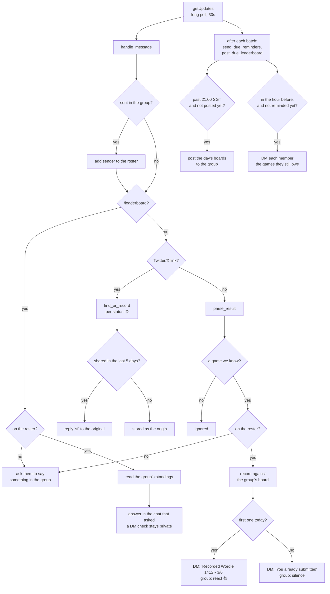

# sfbot

`sfbot` does two things for a Telegram group: it calls out repeated Twitter/X
posts, and it collects everyone's daily puzzle-game results by direct message so
the group gets one leaderboard a day instead of everyone's share text.

## Repeated links

`sfbot` watches a Telegram group for Twitter/X status links. If the same post
was shared in that chat during the previous five days, it sends `sf` as a reply
to the first message so tapping the reply navigates to the original share.

Setting `SFBOT_ACTION_WORD` adds a callout naming whoever reposted. With
`SFBOT_ACTION_WORD=Kick`, Alice sharing a post and Bob resharing it gets:

```
sf                                          (a reply to Alice's message)
Uh oh! Looks like Bob's getting *Kicked*
Let's drop a /KickBob
```

The past tense is the word plus `ed`, and the asterisks are literal: the bot
sends no `parse_mode`, so nothing in a display name ever needs escaping.

The canonical key is Twitter's numeric status ID. As a result, `twitter.com`
and `x.com` links, different usernames, mobile subdomains, tracking parameters,
and `/photo/1` suffixes all resolve to the same post. Origins are stored in an
indexed SQLite database and scoped per Telegram chat.

## Architecture

One process, one SQLite file, no inbound network. Every message takes exactly
one of three paths, and the daily post is checked once per polling cycle.


```mermaid
flowchart TD
    A["getUpdates<br/>long poll, 30s"] --> B["handle_message"]

    B --> Z{"sent in the group?"}
    Z -->|yes| Z2["add sender to the roster"]
    Z2 --> C
    Z -->|no| C

    C{"/leaderboard?"}
    C -->|yes| D{"on the roster?"}
    D -->|no| D2["ask them to say<br/>something in the group"]
    D -->|yes| D3["read the group's standings"]
    D3 --> E["answer in the chat that asked<br/>a DM check stays private"]

    C -->|no| F{"Twitter/X link?"}
    F -->|yes| G["find_or_record<br/>per status ID"]
    G --> H{"shared in the last 5 days?"}
    H -->|yes| I["reply 'sf' to the original"]
    H -->|no| J["stored as the origin"]

    F -->|no| K["parse_result"]
    K --> L{"a game we know?"}
    L -->|no| M["ignored"]
    L -->|yes| L2{"on the roster?"}
    L2 -->|no| D2
    L2 -->|yes| N["record against<br/>the group's board"]
    N --> O{"first one today?"}
    O -->|yes| P["DM: 'Recorded Wordle 1412 - 3/6'<br/>group: react 👍"]
    O -->|no| Q["DM: 'You already submitted'<br/>group: silence"]

    A --> R["after each batch:<br/>send_due_reminders,<br/>post_due_leaderboard"]
    R --> S{"past 21:00 SGT<br/>and not posted yet?"}
    S -->|yes| T["post the day's boards<br/>to the group"]
    R --> U{"in the hour before,<br/>and not reminded yet?"}
    U -->|yes| V["DM each member<br/>the games they still owe"]
```

Results reach the board from members' DMs, so the group itself stays quiet
until the daily post.

## Prerequisites

The shared Telegram bot already exists, has Group Privacy disabled, and has
been added to the group. Obtain its token securely from the maintainer and put
it in an uncommitted `.env` file:

```dotenv
TELEGRAM_BOT_TOKEN=replace-with-the-real-token
SFBOT_LEADERBOARD_CHAT_ID=-1001234567890
```

`SFBOT_LEADERBOARD_CHAT_ID` is the group the daily leaderboard posts to; see
[Finding the group's chat ID](#finding-the-groups-chat-id). Leave it out to run
link deduplication alone.

Never commit or post the token. Only one instance may use it at a time because
Telegram permits only one active `getUpdates` poller per bot.

## Run locally

Python 3.11 or newer and Make are required. The bot has no third-party runtime
dependencies. From the repository root, run:

```sh
make run
```

If the Python.org macOS installation reports `CERTIFICATE_VERIFY_FAILED`, use
the installed `certifi` bundle:

```sh
SSL_CERT_FILE="$(python3.11 -m certifi)" make run
```

Stop the bot with `Ctrl+C`. The local cache is stored at `data/sfbot.db`.

Run the tests with:

```sh
make test
```

Run the complete local check, including bytecode compilation, with:

```sh
make check
```

The Makefile uses `python3.11` by default. Override it when using another
supported interpreter:

```sh
make check PYTHON=python3.12
```

## Run on the homelab

The production instance runs as one Docker container on the group's homelab.
It uses Telegram long polling, so the host needs outbound HTTPS access but no
domain, reverse proxy, port forwarding, or inbound port.

After cloning the repository, create `.env` as shown above and run:

```sh
chmod 600 .env
docker compose up -d --build
docker compose ps
make logs
```

Docker's `restart: unless-stopped` policy restarts the bot after a crash or host
reboot, provided the Docker service starts at boot. The `sfbot-data` named
volume preserves `/data/sfbot.db` across container rebuilds.

To deploy a new revision:

```sh
git pull
docker compose up -d --build
make logs
```

## One-bot development workflow

Never run the homelab and local instances simultaneously. Before a live local
test, stop production on the homelab:

```sh
docker compose stop sfbot
```

Run the bot locally with `make run`, stop it with `Ctrl+C`, then restore
production on the homelab:

```sh
docker compose start sfbot
```

Local testing uses a separate SQLite database, so production may not remember
links consumed while the local instance was active. This is acceptable for the
bot's short, non-critical five-day history.

## Daily games leaderboard

Results go to the bot in a direct message, never to the group. The group only
ever sees one message a day: the leaderboard itself.

Send the bot a DM containing a game's share text and it replies with what it
recorded:

```
you:  Wordle 1,412 3/6
      ⬛🟨⬛⬛⬛
      🟩🟩🟩🟩🟩

bot:  Recorded Wordle 1412 - 3/6
```

An hour before the post, the bot DMs each member of the roster the games they
have not submitted yet, skipping anyone who has played all of them. A member who
never pressed Start cannot be DM'd; that failure is logged and the rest still go
out. Unlike the post itself, a reminder missed while the bot was down is dropped
rather than sent late, since a warning about a board that has already gone up is
worse than none.

At 21:00 SGT the bot posts the day's boards to the group. Each game gets its own
board, ordered best result first; there is no combined points table. Anyone can
also ask for the standings early with `/leaderboard`, which answers in whichever
chat it was sent from — in a DM that keeps the check private, in the group it
posts for everyone.

Pasting a result into the group still works and still counts, acknowledged with
a 👍 rather than a reply. It just defeats the point.

The first result a person submits for a game on a given day is final. A second
submission is refused, so a bad score cannot be quietly replaced.

Days are bucketed by a fixed UTC offset rather than a named timezone, because
Singapore has observed no DST since 1982 and this keeps the container free of a
timezone database. A result sent after local midnight counts toward the new day.

### Finding the group's chat ID

The leaderboard needs to know which group to post to, and Telegram group IDs are
not shown in the app. Start the bot without `SFBOT_LEADERBOARD_CHAT_ID`, send
`/leaderboard` in the group, and read the ID out of the logs:

```sh
make logs
# ... Ignoring /leaderboard: set SFBOT_LEADERBOARD_CHAT_ID to the group's
#     chat ID. This chat's ID is -1001234567890
```

Put that value in `.env` and restart. Until it is set, the leaderboard is off
entirely and the bot only does link deduplication.

### Who may submit

Only people the bot has seen in the group can submit results or read the board
from a DM. The roster is learned rather than configured: any message in the
group — ordinary conversation counts, since Group Privacy is off — adds its
sender. Nobody has to post a result in the group to get on it.

A DM from someone not on the roster is answered with a note asking them to say
something in the group first, and nothing is recorded. Sending the bot a DM
never adds anyone, so a stranger who finds the bot's username cannot put
themselves on the board.

Two consequences worth knowing: a member who has genuinely never said anything
in the group has to speak once before their first submission, and someone who
leaves the group stays on the roster until the database is cleared.

Each member also has to message the bot once before it can reply to them —
Telegram forbids bots from opening a conversation. Tapping the bot's name in the
group's member list and pressing Start is enough.

### Adding a game

Wordle, Connections, Krillion, and Fermi ship today. To add another, write a
parser in `sfbot/games.py` that returns a `ParsedResult` (or `None`) and add it
to the `GAMES` tuple:

- `puzzle_id` identifies the day's puzzle and is shown in the board heading.
- `score` is the text shown to players, for example `3/6`.
- `rank_key` orders the board, lowest first. An unsolved puzzle needs a value
  above every solved one. Negate it when the game scores higher-is-better, as
  Krillion's dive depth does.

Anchor the pattern to whole lines so prose that merely mentions the game does
not match, and add cases to `tests/test_games.py` from real share text.

## Configuration

| Variable | Default | Purpose |
| --- | --- | --- |
| `TELEGRAM_BOT_TOKEN` | Required | Token for the shared Telegram bot |
| `SFBOT_DB_PATH` | `data/sfbot.db` | SQLite database path |
| `SFBOT_RETENTION_DAYS` | `5` | Duplicate window in whole days |
| `SFBOT_POLL_TIMEOUT` | `30` | Telegram long-poll timeout in seconds |
| `SFBOT_LOG_LEVEL` | `INFO` | Python log level |
| `SFBOT_LEADERBOARD_CHAT_ID` | Unset | Group the leaderboard posts to; unset disables the feature |
| `SFBOT_UTC_OFFSET_MINUTES` | `480` | Local day boundary for the leaderboard (480 = SGT) |
| `SFBOT_LEADERBOARD_AT` | `21:00` | Local time of the daily post; `off` for `/leaderboard` only |
| `SFBOT_ACTION_WORD` | Unset | Verb for the repeat-poster callout; unset sends `sf` alone |

## Behavior details

- Deduplication is per Telegram chat, not global across every group.
- The earliest share remains the reply target for the five-day window.
- If the original message was deleted, the current share becomes the new
  origin without sending an orphaned `sf` reply.
- Text messages, media captions, and links hidden behind Telegram linked text
  are supported.
- `t.co` links are not resolved.
